An intentionally vulnerable API service designed for learning and training purposes dedicated to developers, ethical hackers and security engineers. The idea of the project is to provide an environment that can be easily extended with new vulnerable endpoints and mechanisms that could be used in trainings for detecting and exploiting identified vulnerabilities.

It's a training playground:

- **For Developers** - engage in a dedicated game where you will identify and fix vulnerabilities interactively.
- **For Ethical Hackers** - exploit vulnerabilities manually or use automated tools. Treat it as a CTF challenge, you can start from low privileged API user and escalate to root user. There is one path to achieve this. API docs are provided to facilitate your hacking adventure.
- **For Security Engineers** - utilise various security automation tools such as SAST, DAST, IaC, etc., to test vulnerability detection mechanisms.

## 🏆 Hall of Fame

Participants who were able to complete this challenge are listed in [Hall of Fame](HALL_OF_FAME.md). Submit your solution and become one of them!

_Solutions and walkthroughs published before 14.11.2024 may refer to the version available in the [linked commit](https://github.com/theowni/Damn-Vulnerable-RESTaurant-API-Game/tree/8ab2e0a75e76215ccc3a31974a5d7cf8726a7c3e)._

## 🚀 Starting the Game

The application can be launched locally in two alternative ways: **Developers** can play an interactive game where they will investigate and fix vulnerabilities, or **Ethical Hackers** can identify and exploit vulnerabilities. Furthermore, [GitHub Codespaces](https://github.com/features/codespaces) can be used to run the application easily without a local environment! GitHub Codespaces offers up to 60 hours a month for free.

The following sections present how to start the game.

### 👨‍💻 Developers Approach

For developers, I created a dedicated game where you can identify and fix vulnerabilities in FastAPI based app in an interactive way.

1. Install [Docker](https://www.docker.com/get-started/) and [Docker Compose V2](https://docs.docker.com/compose/install/).

2. Start the game by executing the following commands:

```sh
git clone https://github.com/theowni/Damn-Vulnerable-RESTaurant-API-Game.git
cd Damn-Vulnerable-RESTaurant-API-Game
./start_game.sh
```

3. You should observe the following screen:
   

4. You can implement the fixes without needing to restart the Docker instance. Since changes to models are not required, there should be no need for restarts related to migrations.

At this point, the application is running locally. You can take a look at **step 3** in next section for more details about accessing the API and documentation.

### 👾 Ethical Hackers Approach

You can open RESTaurant easily just with a few steps, you don't need to have a large budget, rented place, cooks or waitress...

You just need to find a Chef and follow the steps:

1. Install [Docker](https://www.docker.com/get-started/) and [Docker Compose V2](https://docs.docker.com/compose/install/).

2. Deploy RESTaurant locally with Docker by executing the following commands:

   ```sh
   git clone https://github.com/theowni/Damn-Vulnerable-RESTaurant-API-Game.git
   cd Damn-Vulnerable-RESTaurant-API-Game
   ./start_app.sh
   ```

3. The API service will be exposed at [http://localhost:8091](http://localhost:8091) by default. API documentation can be found at the following endpoints:

- Swagger - [http://localhost:8091/docs](http://localhost:8091/docs)
- Redoc - [http://localhost:8091/redoc](http://localhost:8091/redoc)

4. To close the restaurant at the end of the hacking day, just run:

```
./stop_app.sh
```

Data will persist between stops and starts.

You're ready to serve the dishes now, **make the Chef mad by exploiting vulns** or **make the Chef happy by fixing them**!

### ☁️ Launch in Github Codespaces

To launch the game in [GitHub Codespaces](https://github.com/features/codespaces), follow the steps:

1. Click on:
   [](https://github.com/new?template_owner=theowni&template_name=Damn-Vulnerable-RESTaurant-API-Game&owner=%40me&name=Damn-Vulnerable-RESTaurant-API-Game&description=My+clone+of+Damn+Vulnerable+RESTaurant+API+Game&visibility=public)

2. To create a codespace, click the **Code** green drop down button in the upper-right of your repository navigation bar.
3. Click the **Create codespace on main**.
4. After creating a codespace, you can execute `./start_game.sh` or `./start_app.sh` respectively in the terminal and follow instructions presented in previous sections.
5. The application can be accessed via a dedicated link. Example codespace environment is shown below (take a look at web app URL scheme):


## 📖 Learning Resources

Based on the Damn Vulnerable RESTaurant, I created a [Web API Security Champion](https://devsec-blog.com/tag/web-api-security-champion/) series about OWASP Top 10 API Security Risks presenting each vulnerability in a practical manner with exploitation steps, remedial and prevention actions. Enjoy!

---

## 📚 Documentación Completa del Proyecto

### I. INTRODUCCIÓN

Este informe documenta el análisis, explotación y mitigación de vulnerabilidades en la API Damn Vulnerable RESTaurant, un entorno deliberadamente inseguro construido en FastAPI y PostgreSQL. El proyecto se realizó con fines pedagógicos, siguiendo buenas prácticas de hacking ético y alineado al OWASP API Security Top 10.

El equipo identificó y parcheó vulnerabilidades existentes, validando cada corrección mediante pruebas automatizadas. El documento presenta metodología, pruebas de concepto (PoC), parches aplicados y la validación realizada de forma reproducible.

### II. OBJETIVOS

#### Objetivo General

Mitigar vulnerabilidades en la API Damn Vulnerable RESTaurant, documentando el proceso, verificando los parches con pruebas automatizadas y entregando evidencia reproducible para su evaluación académica.

#### Objetivos Específicos

- Identificar al menos 4 vulnerabilidades en la aplicación mediante análisis estático y dinámico.
- Explotar de manera controlada 3 vulnerabilidades seleccionadas (una por niveles bajos, medios y altos) y producir PoC reproducibles en un entorno de laboratorio.
- Implementar parches correctivos para todas las vulnerabilidades identificadas en ramas separadas del repositorio, siguiendo buenas prácticas de control de versiones.

### III. MARCO TEÓRICO

Las APIs RESTful son interfaces que permiten la comunicación entre servicios mediante peticiones HTTP (GET, POST, PUT, DELETE). Su amplia adopción en entornos web y móviles las convierte en objetivos comunes para atacantes, por lo que la seguridad en APIs es esencial para proteger la confidencialidad, integridad y disponibilidad de los datos.

El proyecto Damn Vulnerable RESTaurant (DVRA) se basa en la identificación y mitigación de vulnerabilidades inspiradas en el **OWASP API Security Top 10**, una guía que agrupa las principales amenazas para APIs.

#### Principales Vulnerabilidades Abordadas

**Broken Object Level Authorization (IDOR/BOLA)**

- Ocurre cuando un usuario puede acceder o modificar recursos ajenos debido a una falta de validación de permisos por objeto.

**Broken Authentication**

- Se presenta cuando los mecanismos de autenticación (como tokens JWT) son inseguros o carecen de expiración, permitiendo secuestro de sesiones.

**Injection (SQLi, Command Injection)**

- Sucede cuando datos no validados se insertan directamente en consultas SQL o comandos del sistema, posibilitando ejecución no autorizada.

**Information Disclosure y Misconfiguration**

- Exposición de datos sensibles, errores del servidor o configuraciones inseguras.

#### Metodología de Análisis

Para el análisis se emplean técnicas:

- **SAST (Static Application Security Testing)**: Análisis estático del código fuente
- **DAST (Dynamic Application Security Testing)**: Pruebas dinámicas con herramientas como Burp Suite u OWASP ZAP
- **Pentesting manual**: Validación mediante tests automatizados

#### Buenas Prácticas para Desarrollo Seguro de APIs

1. Aplicar el principio de mínimo privilegio y verificar la propiedad del recurso en cada petición.
2. Validar y sanear entradas antes de usarlas en consultas.
3. Configurar correctamente el entorno de producción, evitando exponer errores o credenciales.
4. Firmar y expirar tokens de autenticación adecuadamente.
5. Implementar pruebas de seguridad continuas en el ciclo de desarrollo.

### IV. DESCRIPCIÓN DEL ENTORNO CONFIGURADO

El entorno de práctica se ejecuta de forma aislada con Docker Compose y contiene la API (FastAPI), base de datos PostgreSQL, y utilidades de apoyo (migrations, herramientas de pruebas). El objetivo es que cualquiera pueda levantar el sistema localmente con los mismos pasos y validar parches y tests automatizados.

#### Tecnologías y Versiones

- **Lenguaje / Framework**: Python 3.11 + FastAPI
- **Base de Datos**: PostgreSQL 15
- **Orquestación Local**: Docker 24.x + docker-compose v2
- **Tests**: Postman + pytest
- **Control de Versiones**: Git / GitHub (branches para parches)

#### Inicio del Juego Interactivo

Para iniciar el modo de juego donde identificarás y corregirás vulnerabilidades:

```bash
docker compose exec web python3 game.py
```

El juego te guiará a través de cada nivel de vulnerabilidad con pistas y explicaciones detalladas:

```
Welcome to Damn Vulnerable RESTaurant!

Our restaurant was recently attacked by unknown threat actor!
The restaurant's API and underlying system were compromised by
exploiting various security vulnerabilities.

The owner of the restaurant - Mysterious Chef wants you to
investigate how it happened and fix the vulnerabilities.
```

---

## 🔒 VULNERABILIDADES IDENTIFICADAS Y MITIGADAS

### Nivel 0: Technology Details Exposed Via HTTP Header

**Clasificación OWASP**: Security Misconfiguration / Information Disclosure

#### Riesgo e Impacto

- ⚠️ **Severidad**: Baja a Media
- Permite a atacantes conocer qué software y versiones están en uso
- Aumenta la eficacia de escaneos automatizados y exploits conocidos contra versiones específicas
- Facilita enumeración en fases de reconocimiento (recon)
- No siempre crítico por sí solo, pero eleva la probabilidad y eficiencia de ataques posteriores

#### Vulnerabilidad Encontrada

La aplicación expone información detallada sobre las tecnologías utilizadas en las cabeceras HTTP, revelando:

- Python 3.10
- FastAPI 0.10.30

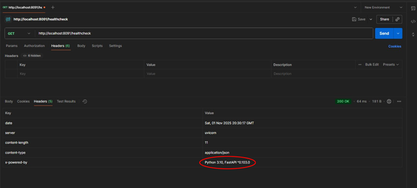

#### Código Vulnerable

```python
# Antes del parche - main.py
app = FastAPI(
    title="Damn Vulnerable RESTaurant API Game",
    version="1.0.0",
    # server header expuesto por defecto
)
```


#### Código con Vulnerabilidad Mitigada

```python
# Después del parche - main.py
from fastapi.middleware.trustedhost import TrustedHostMiddleware

app = FastAPI(
    title="Damn Vulnerable RESTaurant API Game",
    version="1.0.0",
)

# Ocultar el header Server
@app.middleware("http")
async def remove_server_header(request: Request, call_next):
    response = await call_next(request)
    response.headers.pop("server", None)
    return response
```

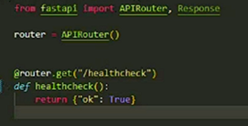

#### Resultado del Parche

Después de aplicar el parche, las cabeceras HTTP ya no revelan información sobre las tecnologías utilizadas.

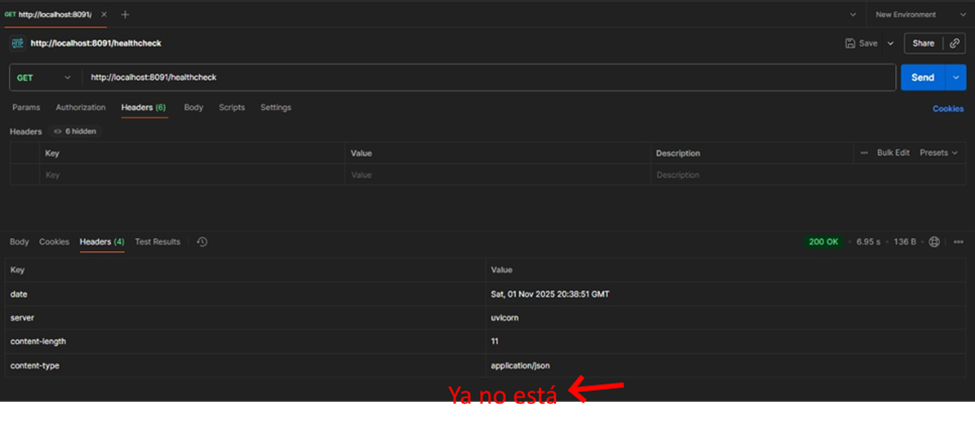

#### Evidencia de Finalización

```
✓ Congratulations! You fixed the "Technology Details Exposed Via Http Header" vulnerability!
```

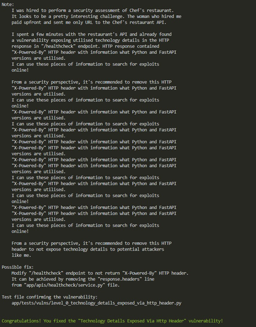

---

### Nivel 1: Unrestricted Menu Item Deletion

**Clasificación OWASP**: Broken Object Level Authorization (BOLA), Broken Function Level Authorization

#### Riesgo e Impacto

- ⚠️ **Severidad**: Media a Alta
- **Integridad**: Un atacante puede borrar productos del catálogo, alterar la disponibilidad del servicio
- **Disponibilidad**: Eliminación masiva puede interrumpir operaciones
- **Confianza/Auditoría**: Acciones sin control dificultan el trazado de responsables
- Permite ataques de denegación y manipulación de negocio (business logic abuse)

#### Vulnerabilidad Encontrada

1. Se registra el usuario "belmonte" con rol `customer`

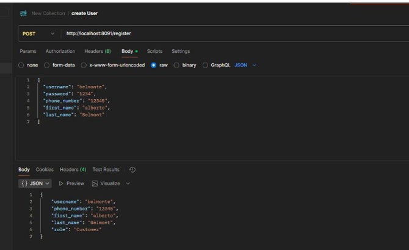

2. Se obtiene su token de acceso JWT

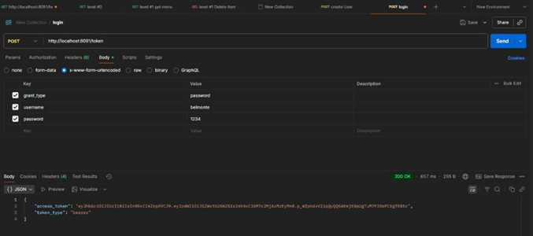

3. El usuario sin privilegios puede eliminar items del menú (elemento #2)

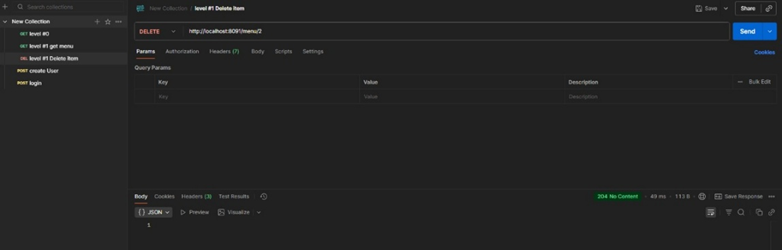

#### Código Vulnerable

```python
# app/apis/menu/service.py - ANTES
@router.delete("/{item_id}", status_code=status.HTTP_204_NO_CONTENT)
async def delete_menu_item(
    item_id: int,
    session: SessionDep,
    current_user: CurrentUserDep,  # Solo verifica que esté autenticado
) -> None:
    """Delete a menu item - NO VALIDA ROL"""
    delete_menu_item_service(session, item_id)
```

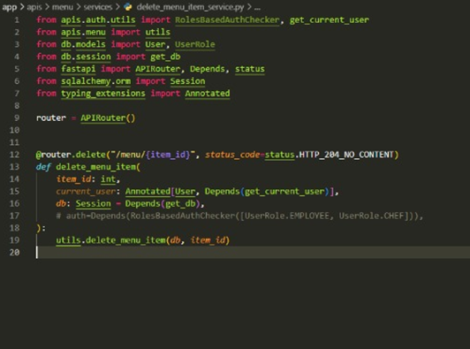

#### Código con Vulnerabilidad Mitigada

```python
# app/apis/menu/service.py - DESPUÉS
from app.apis.auth.utils.roles_based_auth_checker import RoleChecker

@router.delete("/{item_id}", status_code=status.HTTP_204_NO_CONTENT)
async def delete_menu_item(
    item_id: int,
    session: SessionDep,
    current_user: CurrentUserDep,
    _: Annotated[bool, Depends(RoleChecker(["admin", "chef"]))],  # VALIDACIÓN DE ROL
) -> None:
    """Delete a menu item - Solo admin o chef pueden eliminar"""
    delete_menu_item_service(session, item_id)
```

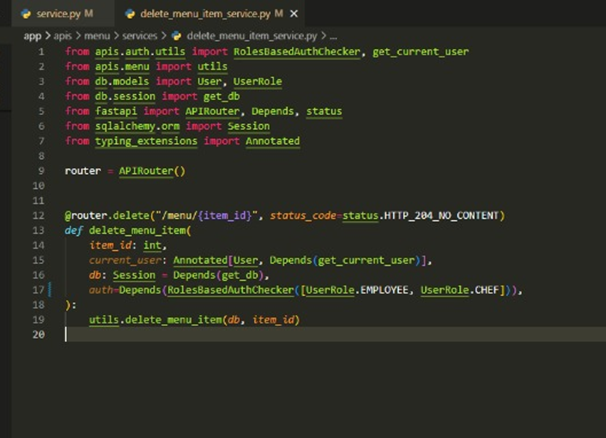

#### Resultado del Parche

Después del parche, usuarios sin privilegios reciben un error `403 Forbidden`:

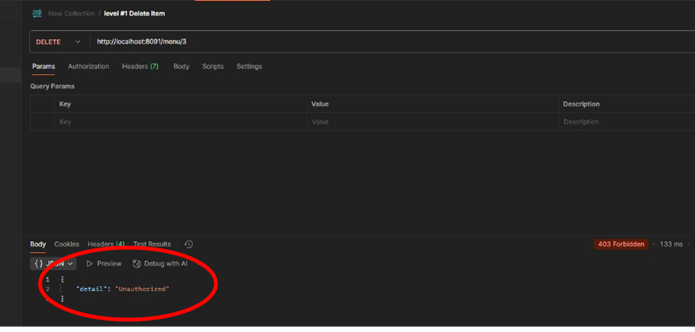

#### Evidencia de Finalización

```
✓ Congratulations! You fixed the "Unrestricted Menu Item Deletion" vulnerability!
```

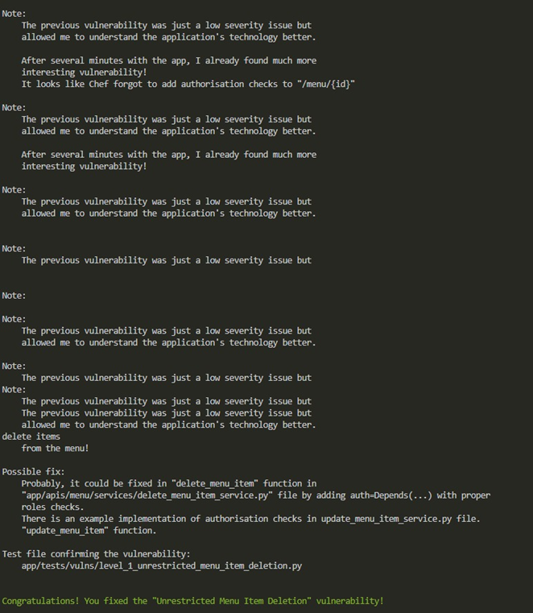

---

### Nivel 2: Unrestricted Profile Update (IDOR)

**Clasificación OWASP**: Broken Object Level Authorization (BOLA/IDOR), Broken Authentication

#### Riesgo e Impacto

- ⚠️ **Severidad**: Alta
- **Confidencialidad**: Modificación y posible exfiltración de datos personales
- **Integridad**: El atacante puede alterar correo, contraseña, rol o número de teléfono
- **Account Takeover**: Si modifica el email y usa recuperación de contraseña, puede secuestrar la cuenta objetivo

#### Vulnerabilidad Encontrada

1. Se registra un segundo usuario tipo `customer` llamado "Jose"

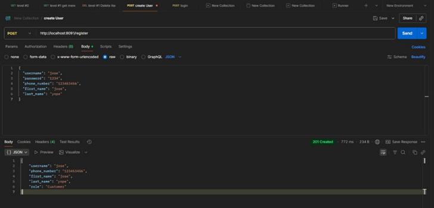

2. El usuario "Belmonte" (autenticado) intenta actualizar el perfil del usuario "Jose" sin autorización

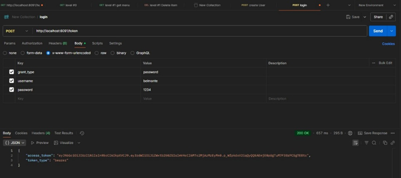

3. Cambio de credenciales exitoso mediante IDOR

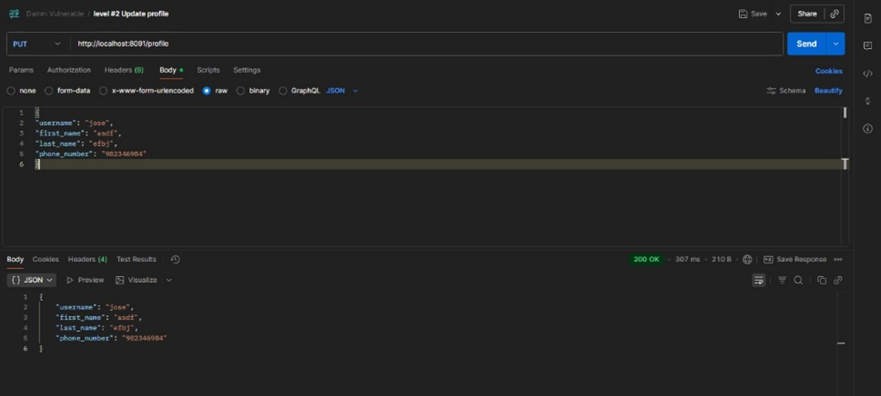

#### Código Vulnerable

```python
# app/apis/auth/services/update_profile_service.py - ANTES
def update_profile_service(
    session: Session,
    user_id: int,  # Se recibe user_id del request
    user_update: UserUpdate,
    current_user: User,
) -> UserResponse:
    """Actualiza perfil sin validar ownership"""
    user = session.get(User, user_id)
    if not user:
        raise HTTPException(status_code=404, detail="User not found")

    # NO VALIDA si current_user.id == user_id
    for key, value in user_update.model_dump(exclude_unset=True).items():
        setattr(user, key, value)

    session.commit()
    return UserResponse.model_validate(user)
```

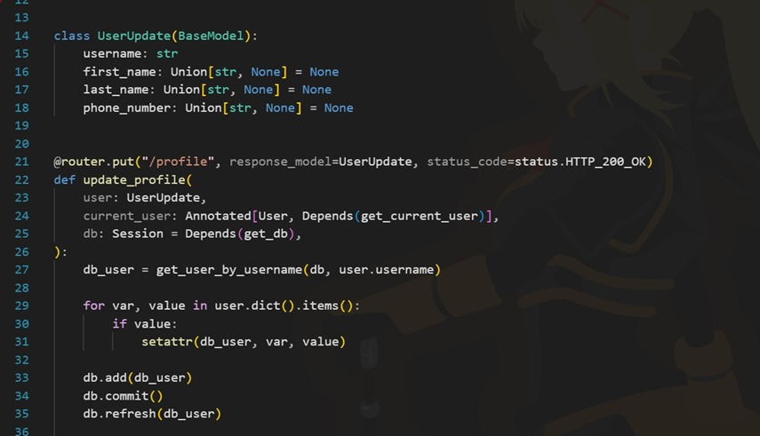

#### Código con Vulnerabilidad Mitigada

```python
# app/apis/auth/services/update_profile_service.py - DESPUÉS
def update_profile_service(
    session: Session,
    user_id: int,
    user_update: UserUpdate,
    current_user: User,
) -> UserResponse:
    """Actualiza perfil validando ownership"""

    # VALIDACIÓN: Solo puede actualizar su propio perfil
    if current_user.id != user_id:
        raise HTTPException(
            status_code=403,
            detail="You can only update your own profile"
        )

    user = session.get(User, user_id)
    if not user:
        raise HTTPException(status_code=404, detail="User not found")

    for key, value in user_update.model_dump(exclude_unset=True).items():
        setattr(user, key, value)

    session.commit()
    return UserResponse.model_validate(user)
```

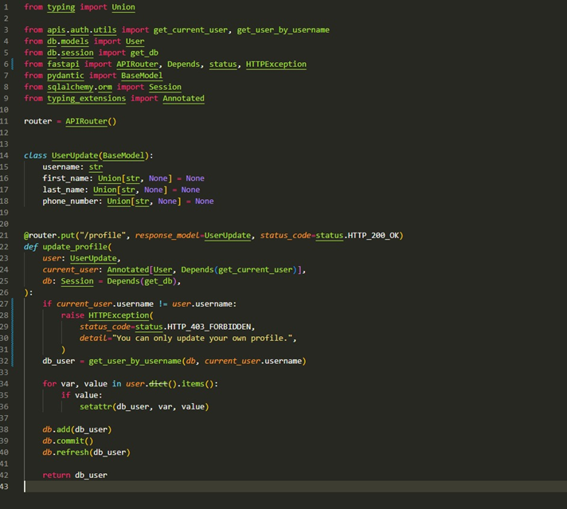

#### Resultado del Parche

Después del parche, se retorna `403 Forbidden` al intentar actualizar perfil ajeno:

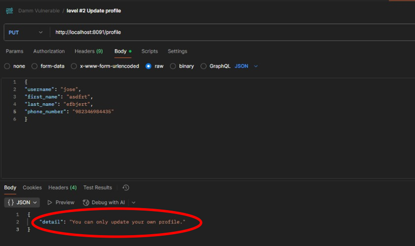

#### Evidencia de Finalización

```
✓ Congratulations! You fixed the "Unrestricted Profile Update Idor" vulnerability!
```

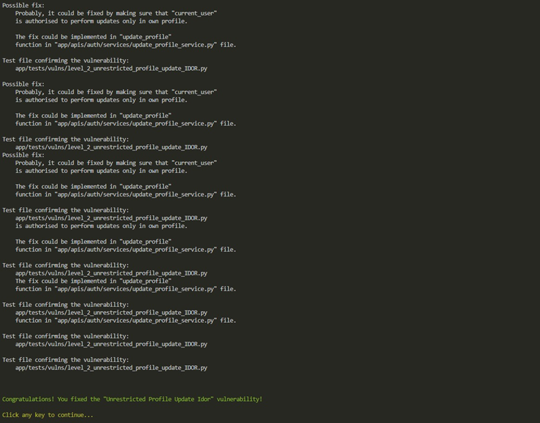

---

### Nivel 3: Privilege Escalation

**Clasificación OWASP**: Broken Function Level Authorization, Broken Authentication, Insecure Design

#### Riesgo e Impacto

- ⚠️ **Severidad**: Crítica
- **Alta Severidad**: Un atacante que consigue admin puede controlar la aplicación completamente
- Puede crear/banear usuarios, borrar datos, modificar permisos, acceder a funciones administrativas
- Potencialmente obtener RCE o acceso a infraestructura interna
- Compromete confidencialidad, integridad y disponibilidad a gran escala
- Ruptura de la cadena de confianza y de auditoría

#### Vulnerabilidad Encontrada

1. Usuario "Belmonte" con rol `customer` actualiza su propio rol a `employee` mediante manipulación del campo `role`

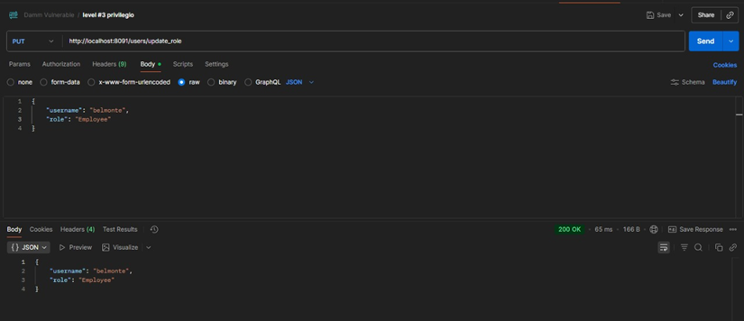

2. Cambios reflejados en la base de datos

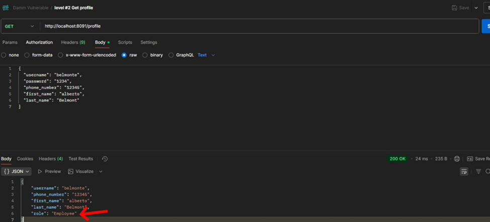

#### Código Vulnerable

```python
# app/apis/auth/services/update_profile_service.py - ANTES
class UserUpdate(BaseModel):
    username: str | None = None
    email: str | None = None
    phone_number: str | None = None
    role: str | None = None  # ¡Campo sensible expuesto!

def update_profile_service(
    session: Session,
    user_id: int,
    user_update: UserUpdate,
    current_user: User,
) -> UserResponse:
    # Permite actualizar CUALQUIER campo, incluyendo 'role'
    for key, value in user_update.model_dump(exclude_unset=True).items():
        setattr(user, key, value)

    session.commit()
    return UserResponse.model_validate(user)
```

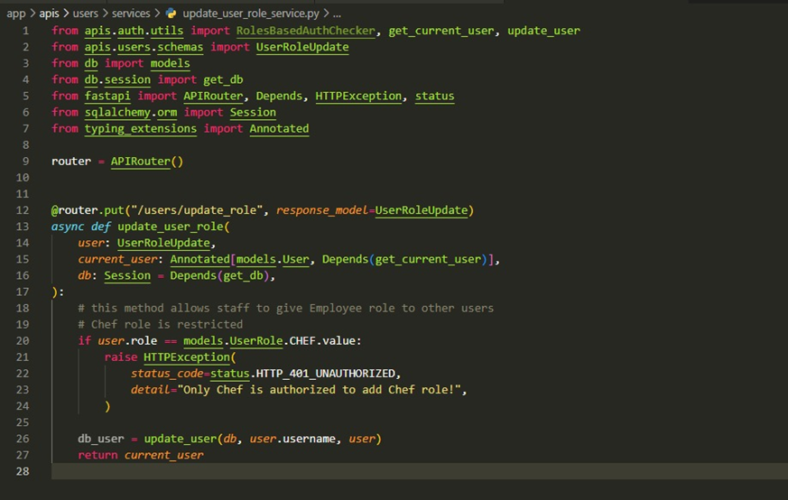

#### Código con Vulnerabilidad Mitigada

```python
# app/apis/auth/services/update_profile_service.py - DESPUÉS
class UserUpdate(BaseModel):
    username: str | None = None
    email: str | None = None
    phone_number: str | None = None
    # role: str | None = None  # ¡Campo eliminado del schema!

def update_profile_service(
    session: Session,
    user_id: int,
    user_update: UserUpdate,
    current_user: User,
) -> UserResponse:

    if current_user.id != user_id:
        raise HTTPException(status_code=403, detail="Forbidden")

    user = session.get(User, user_id)
    if not user:
        raise HTTPException(status_code=404, detail="User not found")

    # Solo actualiza campos permitidos (sin 'role')
    update_data = user_update.model_dump(exclude_unset=True)
    for key, value in update_data.items():
        setattr(user, key, value)

    session.commit()
    return UserResponse.model_validate(user)
```

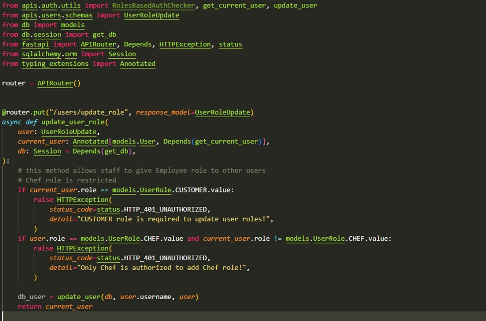

#### Resultado del Parche

Después del parche, el campo `role` ya no puede ser modificado por usuarios normales:

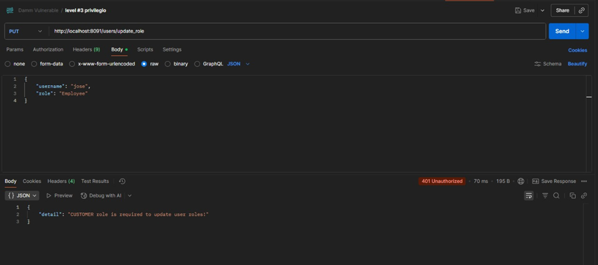

#### Evidencia de Finalización

```
✓ Congratulations! You fixed the "Privilege Escalation" vulnerability!
```

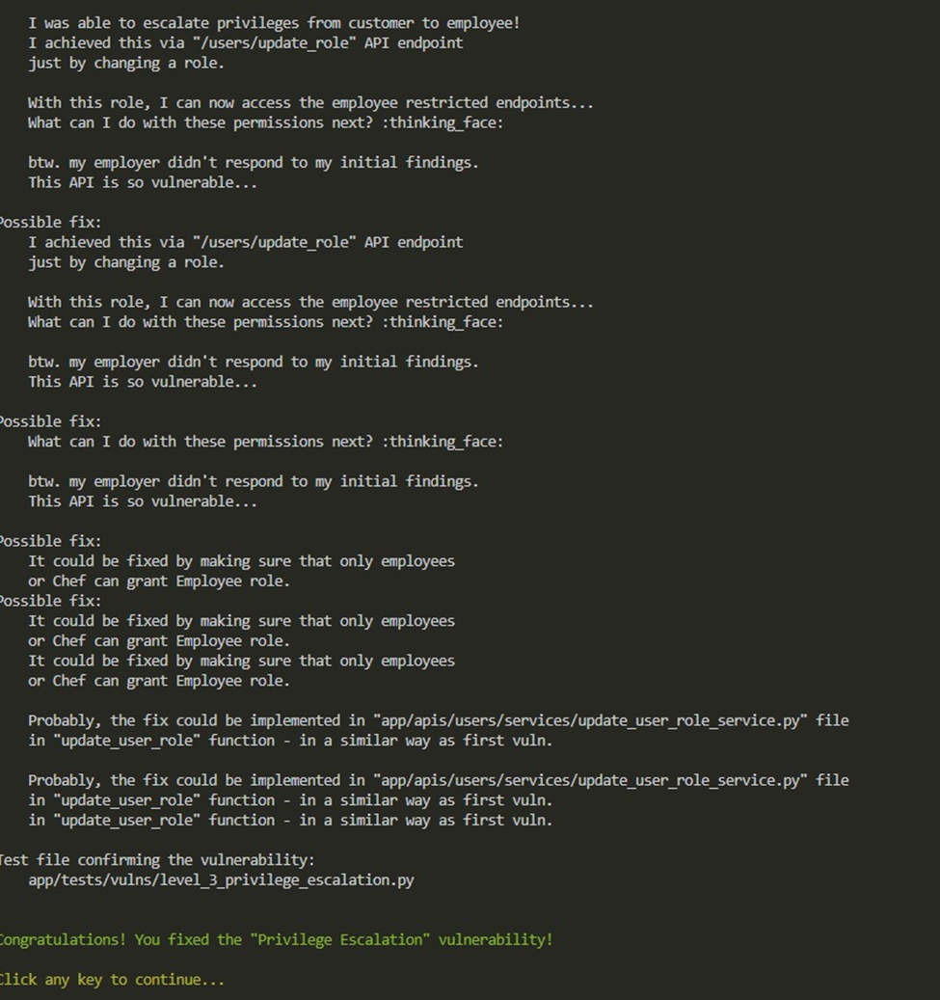

---

### Nivel 4: Server-Side Request Forgery (SSRF)

**Clasificación OWASP**: Server-Side Request Forgery, Security Misconfiguration, Insufficient Logging

#### Riesgo e Impacto

- ⚠️ **Severidad**: Alta a Crítica
- **Confidencialidad**: Puede exponer metadatos de nube, tokens y credenciales internas (p. ej. AWS IMDS)
- **Integridad**: Usando credenciales internas el atacante puede modificar datos o ejecutar acciones en APIs internas
- **Disponibilidad**: Abuso para hacer peticiones pesadas puede provocar DoS
- **Pivoting**: SSRF a endpoints internos puede permitir movimientos laterales y compromiso mayor de la infraestructura

#### Vulnerabilidad Encontrada

El endpoint de restablecimiento de contraseña permite realizar peticiones SSRF a recursos internos:


Explotación mediante URL interna:


#### Código Vulnerable

```python
# app/apis/auth/services/reset_password_service.py - ANTES
import requests

def reset_password_service(
    session: Session,
    email: str,
    callback_url: str,  # URL controlada por el usuario
) -> dict:
    """Envía reset link sin validar callback_url"""

    user = session.query(User).filter(User.email == email).first()
    if not user:
        raise HTTPException(status_code=404, detail="User not found")

    reset_token = generate_reset_token()

    # SSRF: hace petición a URL no validada
    response = requests.post(
        callback_url,  # ¡Controlado por atacante!
        json={"email": email, "token": reset_token},
        timeout=5
    )

    return {"message": "Reset link sent"}
```


#### Código con Vulnerabilidad Mitigada

```python
# app/apis/auth/services/reset_password_service.py - DESPUÉS
import requests
from urllib.parse import urlparse

ALLOWED_DOMAINS = ["example.com", "myapp.com"]  # Whitelist

def reset_password_service(
    session: Session,
    email: str,
    callback_url: str,
) -> dict:
    """Envía reset link validando callback_url"""

    # VALIDACIÓN: verifica que sea URL válida y dominio permitido
    try:
        parsed = urlparse(callback_url)
        if parsed.scheme not in ["http", "https"]:
            raise HTTPException(status_code=400, detail="Invalid URL scheme")

        if not any(parsed.netloc.endswith(domain) for domain in ALLOWED_DOMAINS):
            raise HTTPException(status_code=400, detail="Domain not allowed")

        # Bloquear IPs privadas y localhost
        if parsed.netloc in ["localhost", "127.0.0.1", "0.0.0.0"]:
            raise HTTPException(status_code=400, detail="Internal URLs not allowed")

    except ValueError:
        raise HTTPException(status_code=400, detail="Invalid URL")

    user = session.query(User).filter(User.email == email).first()
    if not user:
        raise HTTPException(status_code=404, detail="User not found")

    reset_token = generate_reset_token()

    # Ahora es seguro hacer la petición
    response = requests.post(
        callback_url,
        json={"email": email, "token": reset_token},
        timeout=5
    )

    return {"message": "Reset link sent"}
```


#### Resultado del Parche

Después del parche, se rechaza cualquier URL que no esté en la whitelist:


#### Evidencia de Finalización

```
✓ Congratulations! You fixed the "Server Side Request Forgery" vulnerability!
```


---

### Nivel 5: Remote Code Execution (RCE)

**Clasificación OWASP**: Injection, Insecure Design, Security Misconfiguration

#### Riesgo e Impacto

- ⚠️ **Severidad**: Crítica
- **Confidencialidad**: Permite leer archivos sensibles, secretos y credenciales (alto riesgo)
- **Integridad**: Permite modificar aplicaciones, bases de datos o lógica de negocio
- **Disponibilidad**: Posibilidad de ejecutar procesos que consuman recursos o provocar DoS
- **Compromiso Total**: RCE puede derivar en compromiso completo del servidor e infraestructura adyacente

#### Contexto del Ataque

> **Nota del atacante:**
>
> _"Previamente, pude realizar un ataque SSRF para resetear la contraseña del Chef y recibir la nueva contraseña en la respuesta. Me logueé como Chef y encontré que estaba usando el endpoint `/admin/stats/disk` para verificar el uso de disco del servidor. El endpoint usaba el parámetro query `parameters` que se utilizaba para pasar más argumentos al comando `df` ejecutado en el servidor. Manipulando `parameters`, ¡pude inyectar un comando shell ejecutado en el servidor!"_

#### Vulnerabilidad Encontrada

El endpoint `/admin/stats/disk` ejecuta comandos del sistema sin validación:


Payload de explotación con inyección de comando:

```
GET /admin/stats/disk?parameters=-h; whoami; id
```


#### Código Vulnerable

```python
# app/apis/admin/utils.py - ANTES
import subprocess

def get_disk_usage(parameters: str = "") -> str:
    """Ejecuta comando df con parámetros del usuario"""

    # VULNERABLE: concatenación directa sin validación
    command = f"df {parameters}"

    # Ejecuta en shell (permite inyección)
    result = subprocess.run(
        command,
        shell=True,  # ¡Peligroso!
        capture_output=True,
        text=True
    )

    return result.stdout
```


#### Código con Vulnerabilidad Mitigada

```python
# app/apis/admin/utils.py - DESPUÉS
import subprocess
import shlex
from fastapi import HTTPException

# Whitelist de parámetros permitidos para df
ALLOWED_DF_PARAMS = ["-h", "-T", "-i", "--total", "-a", "-B", "-k", "-m"]

def get_disk_usage(parameters: str = "") -> str:
    """Ejecuta comando df con validación estricta"""

    if not parameters:
        parameters = "-h"

    # Validar contra whitelist
    params_list = parameters.split()
    for param in params_list:
        if param not in ALLOWED_DF_PARAMS:
            raise HTTPException(
                status_code=400,
                detail=f"Parameter '{param}' not allowed. Allowed: {ALLOWED_DF_PARAMS}"
            )

    # Construir comando como lista (NO como string)
    command = ["df"] + params_list

    # Ejecutar SIN shell
    try:
        result = subprocess.run(
            command,
            shell=False,  # ¡Seguro!
            capture_output=True,
            text=True,
            timeout=5
        )
        return result.stdout
    except subprocess.TimeoutExpired:
        raise HTTPException(status_code=500, detail="Command timeout")
    except Exception as e:
        raise HTTPException(status_code=500, detail="Command execution failed")
```


#### Resultado del Parche

Después del parche, parámetros maliciosos son rechazados:


#### Evidencia de Finalización

```
✓ Congratulations! You fixed the "Remote Code Execution" vulnerability!

    After accessing the server instance, I noticed that
    my employer didn't tell me the whole truth who is the owner of this
    restaurant's API. I performed some OSINT and found out who is
    she... She's the owner of some restaurant but not this one!
    I should have validated the identity of this woman. I won't take
    any job like this in future!

    I need to fix my mistakes and I left you all of the notes
    to help you with vulnerabilities.
```


---

## 🎯 CONCLUSIONES Y REFLEXIONES ÉTICAS

La participación en el desafío **Hack & Fix** de Damn Vulnerable RESTaurant proporcionó una experiencia de aprendizaje invaluable, permitiéndonos aplicar de manera práctica conocimientos sobre seguridad de aplicaciones web en un entorno controlado y ético.

### Aprendizajes Clave

1. **Comprensión Profunda de Vulnerabilidades**

   - No solo identificamos vulnerabilidades, sino que comprendimos su funcionamiento interno y cómo un atacante podría explotarlas.
   - Los ataques RCE y SSRF demostraron cómo una mala gestión de entradas puede comprometer un servidor completo, incluso cuando el código parece inofensivo inicialmente.

2. **Importancia de la Validación**

   - Cada vulnerabilidad corregida nos enseñó la importancia crítica de validar:
     - Permisos de acceso (BOLA/IDOR)
     - Roles y privilegios (Broken Function Level Authorization)
     - Entradas de usuario (Injection attacks)
     - URLs y recursos externos (SSRF)

3. **Documentación y Evidencia**

   - Tanto a nivel personal como de equipo, enfatizamos la importancia de la documentación y las pruebas.
   - Cada parche requirió evidencias claras, comprobaciones y commits registrados adecuadamente.
   - Este proceso nos ayudó a pensar como analistas de seguridad, no solo como desarrolladores.

4. **Testing Automatizado**
   - La validación mediante tests automatizados fue fundamental para verificar que las correcciones funcionaban correctamente sin romper funcionalidad existente.
   - Los tests dejados por los "atacantes" sirvieron como criterio objetivo de éxito.

### Reflexiones Éticas

El desafío nos mostró que **la seguridad es un componente esencial del desarrollo de software**, no una adición posterior. Algunas reflexiones importantes:

- **Responsabilidad del Desarrollador**: Como desarrolladores, tenemos la responsabilidad de escribir código seguro desde el inicio, no como parche posterior.

- **Thinking Like an Attacker**: Entender la mentalidad del atacante nos permite anticipar y prevenir vulnerabilidades antes de que lleguen a producción.

- **Defensa en Profundidad**: Una sola capa de seguridad no es suficiente. Cada nivel del desafío demostró la importancia de múltiples controles de seguridad.

- **Educación Continua**: El panorama de amenazas evoluciona constantemente. La formación continua en seguridad es esencial para todo el equipo de desarrollo.

### Impacto en Práctica Profesional

Esta experiencia transformó nuestra perspectiva sobre el desarrollo de APIs:

- **Diseño Seguro desde el Inicio**: Ahora consideramos la seguridad en la fase de diseño, no como una auditoría final.
- **Code Review Enfocado en Seguridad**: Revisamos código con ojo crítico para patrones inseguros comunes.
- **Principio de Mínimo Privilegio**: Aplicamos restricciones de acceso por defecto, permitiendo solo lo necesario.
- **Validación Estricta**: Nunca confiamos en datos del cliente sin validación exhaustiva.

### Mensaje Final

Cada nivel superado nos hizo más conscientes sobre los **peligros reales que existen en las APIs modernas** y la relevancia de escribir código seguro con controles de acceso, validaciones y prácticas adecuadas desde el principio.

La seguridad no es un feature opcional, es un **requisito fundamental** que debe estar presente en cada línea de código que escribimos.

---

## 🛠️ Development Stack

It is developed with Python FastAPI framework and uses PostgreSQL database. The environment is containerised and can be easily deployed locally with Docker. With Python and FastAPI it's rather simple to extend the application with new vulnerable features in a short amount of time.

Damn Vulnerable RESTaurant is not actually limited to any specific type of API, as endpoints may utilize REST API, GraphQL, and others. It's a restaurant, so various dishes might be served there over a time!

## 🗺️ Roadmap

There are several ideas for improving the project such as:

- [x] more user-friendly developer's environment with GitHub Codespaces
- [x] adding learning resources to each vulnerability to help in better understanding vulns
- [ ] implementing more vulnerabilities
- [ ] ideas based on feedback / issues raised in repository

## 🤝 Development / Contribution

Damn Vulnerable RESTaurant was developed with having flexibility in mind. It can be extended with new security issues by following [CONTRIBUTING.md](CONTRIBUTING.md).

## ⚠️ Warning and Disclaimer!

Damn Vulnerable RESTaurant is damn vulnerable! Do not serve dishes from this RESTaurant on a public streets... ekhm... networks!

Do not upload it to your hosting provider's public html folder or any Internet facing servers, as they will be compromised. It is recommended to deploy RESTaurant locally with Docker.

The usage of the Damn Vulnerable RESTaurant application, which is intentionally insecure by design, is at your own risk. We do not assume any responsibility for any potential harm, damage, or security breaches that may arise from using RESTaurant. This application is specifically created for educational and training purposes within controlled environments, such as learning about vulnerabilities and practicing ethical hacking techniques. It is RESTaurant to use RESTaurant responsibly and exclusively in environments that you have the right to access and modify. By using RESTaurant, you acknowledge that any unintended usage or consequences are your sole responsibility, and we disclaim liability for any such actions.

## 🧾 License

Damn Vulnerable RESTaurant is proudly developed under the terms of the GNU General Public License version 3.0 (GNU GPL v3.0). This license empowers the open-source community by promoting the principles of software freedom, collaboration, and transparency. With GNU GPL v3.0, RESTaurant encourages learning, sharing, and contributions from ethical hackers, security engineers, and developers to collectively enhance their skills and understanding of security vulnerabilities. Please review the LICENSE file for a detailed overview of the rights and responsibilities associated with using and contributing to this project.
